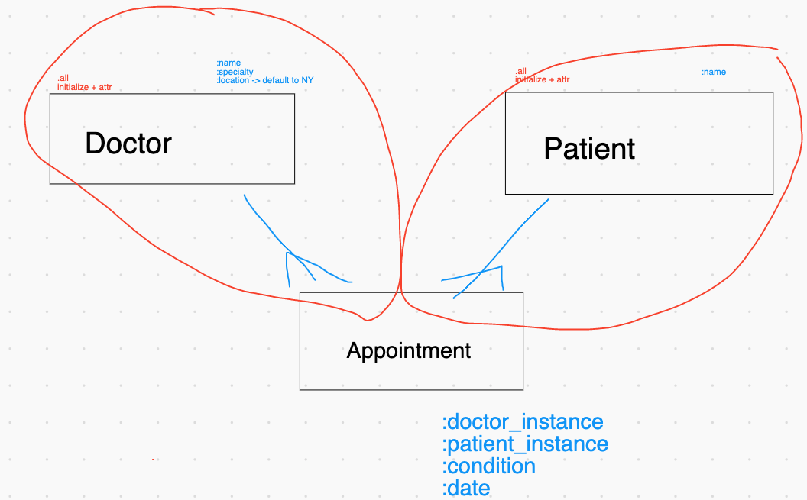

# Many to Many Relationships
---

LECTURE ERD:

## LGs:
- [ ] Revise one-to-many
- [ ] Practice keeping groups of data related to classes on the class as a class variable
- [ ] Practice domain modelling -> drawing ERD
- [ ] Demonstrate Single Source of Truth
- [ ] Implement both sides of a many to many relationships

## Outline

* Quick review of one-to-many:
  * Single Source of Truth Principle:
    - "Class can only store information about their own instances"
  * What is an example of one-to-many relationship:
    - Tweet belongs to a User, User has many Tweets;
    - Leaf belongs to a Tree, Tree has many Leaves;
  * In one-to-many relationship (e.g. Tweet >- User), on which side do I treat the instance as a parameter to initialize to connect the two models?
    - when initializing Tweet, we pass a User instance as an argument;
    - when initializing Book, we pass a Library instance as an argument;
  * In one-to-many relationship, can a User have 0 Tweets?
    - YES

## How to think about relationships
1. For every one (x), how many (y)? 
2. For every one (y), how many (x)?

## Many-to-Many
1. One-to-many
- Tweet >- User
- League -< Team -< Player
- City -< School -< Student

2. Many-to-many
3 mins to come up with examples

Flight -< Ticket >- Passenger
Book -< Copy >- Library 
Album -< RecordLabel >- Artist
Company -< Role >- Worker
<!-- CEO Director -->
Student -< Course >- Subject
Doctor -< Appointment >- Patient

---

## Practice keeping groups of data related to classes on the class as a class variable

Doctor and Patient

* Let's discuss the attributes
    * Doctor: name, specialty, location (default to NY)
    * Patient: name
    * Appointment: sickness, date, prescription <- JOINER
    * medical history + prescriptions
* Let's discuss the methods
    * What are the minimum methods we are going to need?
      * `initialize`
      * `.all`
* Create `.all` method for all the classes

## Tasks (10 mins):
1. Create Patient class with: `initialize` method, `attr_` macro and `.all` method.
1. Create Doctor class with: `initialize` method, `attr_` macro and `.all` method.

## Domain modelling:
* How many classes do we need?

* A doctor has many patients and a patient has many doctors
* A doctor has many appointments / appointment belongs to doctor (we already know how to model this)
* A patient has many appointments / appointment belongs to patient (we already know how to model this)
* A doctor has many patients through appointments
* A patient has many doctors through appointments

## Understand single source of truth by not storing collections of objects on other objects
* How can we build relationship among these classes?
    * Using JOINER class
* Connecting all three classes using JOINER class:
    * Make sure to pass into a joiner instance the instances of the other two classes.

## Tasks (10 mins):
2. Create the JOINER class with `initialize` method, `attr_` macros and `.all` method.
3. Create `#doctors` method in the Patient class that return all the doctors who have appoinment with a perticular patient (hint: you need a helper method)

## Implement both sides of a many to many relationship
* many to many => one to many + one to many

* A doctor has list of patients!
    * `Doctor#patients` -- all the patients of the given doctor
* A patients has list of doctors!
    * `Patient#doctors` -- all the doctors of the given patient

## Code Challenge skills
In evaluating the code challenge,  we will be checking if you were able to meet the deliverables in time and to demonstrate that you (in random order):
- understand the difference between instance/class methods -> do you know when to use which (e.g. from reading deliverables) and what the correct syntax is;
- understand what `self` is and use it correctly (to e.g. create an instance from one side on the other side or to write a class method)
- you always choose the correct enumerable method for the job
understand the naming conventions in Ruby (class is capitalized, variables are not; `@instance_variable`, `@@class_variable`)
- understand the two `attr_` macros and do not overwrite any of them unless you’re building a custom fancy reader/writer (not a deliverable on a code challenge)
you test your code -> for instance, if you have an `end-of-input` error it tells me that you did not run your code at all;
- you can set up a one-to-many and many-to-many relationship correctly (you understand which model knows about the other models or that you need to pass the entire instance, not a string of a name)
- you can access the information from one side on the other side (e.g. `User#tweets`)

BROWNIE POINTS (but also in some cases stuff that if notorious on the opposite side can result in a fail):
- you use helper methods -> after having written your code, you refactor to  avoid repetitions
- you name your variables in a descriptive manner without using shortcuts and on the flipside, if I can’t debug your code because you called the vars in a way that I’d need to spend more than 3 minutes to orient myself in your codebase
- you pseudocode
- you google and use docs effectively and tell us what you googled in a comment and on the flip side, if we see you used lecture or lab code
- connected to googling, you can use non-basic methods (e.g. .clamp instead of a huge if/else to limit the number) and on the flip side, if you’re using the wrong iterator but made it work (e.g. map with a condition -> that should be select)
